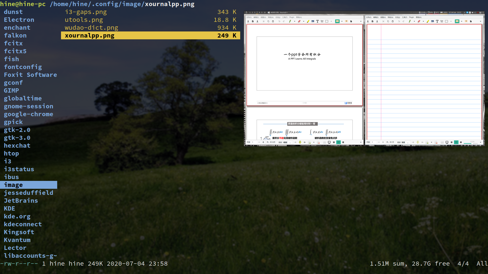

# 这是我manjaro的一堆配置文件,方便重装后直接把配置拉回来  
这个README将记录我比较喜欢的软件, 方便重装的时候想到他们  
## i3-gaps  
这个不能少, 可以说是我用Linux很重要的一个原因  
这是个平铺桌面管理器,非常简单易用  
### i3 config  
涉及到的软件:
```
xsettingsd  //用来启动TIM这类程序的,也可以用gnome那个,但是gnome那个要装整个桌面,不喜欢,而且还会破坏主题,这个在其它桌面(deamon)用dump_xsettingsd可以直接剽窃这个桌面的主题.  
picom //窗口渲染器  
fcitx  //输入法
xfce4-power-manager //电源管理器
utools  
xfce4-clipman  //剪贴板历史,这个可以从配置文件删掉,感觉没啥用  
variety  //壁纸软件  
flameshot //截图
xclip和scrot //截图
xorg-xinput //触控板,不过被下面那个程序覆盖了  
xf86-input-synaptics //触控板配置,好用,功能很多
network-manager-applet //wifi GUI带托盘
blueman  //蓝牙
xf86-input-synaptics //亮度
alacritty //终端,!!在拉这个配置之前一定要装,否则就动不了了!!
chromium
dmenu
volumeicon //音量托盘
xdotool //virtual mouse模拟鼠标模式
xrandr //orientation屏幕翻转模式
```
### 配置出来的功能  
#### virtual mouse模拟鼠标模式
依赖xdotool  
super+m进入/退出模式  
上下左右hjkl控制鼠标移动,加shift可以快速移动,加shift和super可以精确移动  
super+上下左右/hjkl可以模拟滚动  
u是左键,i是右键  
### orientation屏幕翻转模式  
依赖xrandr  
super+o进入/退出该模式  
上下左右hjkl控制屏幕翻转(按照重力方向)

  
## polybar  
就是我在i3-gaps配的bar了,i3bar不太会配,于是就找polybar搬配置了,配置大部分是般theniceboy theCW大佬的,其实也跟polybar文档的bar差不多  
## xournalpp  
这是一个很强的手写软件, 
它可以写作业,做草稿本,编辑pdf,在Linux用它编辑PDF在合适不过了  

## vim  
这个不用说了  
## utools  
这是一个快捷启动器,非常方便,经常用它来启动TIM这类不在bin下的程序,和rofi类似的东西,只不过个人还是习惯utools,而且它还有很多插件,它有很多文档查看插件,看编程文档很全.  

## flameshot   
截图工具,好用  
## wudao-dict
无道词典,带例句,非常好用的用于词典,不过得从github上clone  

## ranger  
依赖ueberzug(预览图片),得用python装,它的以来可以去github上看(如果运行不正常很可能就是依赖问题)  
很好用的一个终端文件管理器.

## fish  
超好用的shell,不兼容bash语法,但和zsh有的一拼.Linux留住我的原因之一,连cd都爽翻了  
oh-my-fish装主题bobthefish不错,不装也不错,oh-my-fish请看github  

## scrcpy  
通过adb来与手机协同工作(华为协同就是用了这个项目)  
## playonlinux  
这是用wine运行windows软件的,很好用  
管理wine的好工具  

## kdeconnect  
好用,不过我没用kde  


## 我自己做的小脚本  
### bing
可以链接倒bin里面
```bash
#!/bin/bash
w3m "https://cn.bing.com/search?q=$*"
```
### terlat
这个严格来说是我改别人的,原作者仓库https://github.com/denstiny/Terslation.git

/bin/terlat  
```bash
#!/bin/bash
if [ $# != 0 ];then
    echo $@ > /usr/local/src/fanyi/.fanyi.txt
    python /usr/local/src/fanyi/fanyi.py
else
    echo "Ctrl-D/C or Enter wit empty to exit"
    while [ 1 ] 
    do 
        read -e text_raw
        if [ "$text_raw" == '' ]; then
            exit
        fi
        echo $text_raw > /usr/local/src/fanyi/.fanyi.txt
        python /usr/local/src/fanyi/fanyi.py
    done
fi
````
/usr/local/src/fanyi/fanyi.py  
```Python
#!/usr/bin/env python
# coding=utf-8
try:
    import requests
    import re
    def main():
            URL= "http://fanyi.youdao.com/translate?smartresult=dict&smartresult=rule"
            Str = ""
            Strend = ""
            resStr = '\"tgt\"\:\"(.*?)\"\}'
            with open("/usr/local/src/fanyi/.fanyi.txt","r") as f:
                for line in f:
                    Str += line
            data = {
                "i":Str,
                "from":"AUTO",    
                "to":"AUTO",
                "doctype":"json"
            }
            res = requests.post(url = URL,data = data)
            res = res.content.decode("utf-8")
            StrJson = re.findall(resStr,res,re.S)
            for str in StrJson:
                Strend += str
            print(Strend)
    main()
except:
    print("KeyboardInterrupt");
    pass

```
## Jottings-timemgr
https://github.com/KudouKaito/Jottings.git


最后,这是我的pacman -Q:
```bash
a52dec 0.7.4-11
aalib 1.4rc5-14
accountsservice 0.6.55-2
acl 2.2.53-3
acorn 1:7.2.0-1
acpi 1.7-3
acpid 2.0.32-1
acpitool 0.5.1-6
adobe-source-code-pro-fonts 2.030ro+1.050it-6
adobe-source-han-sans-cn-fonts 2.001-1
adobe-source-han-serif-cn-fonts 1.001-2
adwaita-icon-theme 3.36.1-1
alacritty 0.4.3-1
alsa-firmware 1.2.1-2
alsa-lib 1.2.2-1
alsa-oss 1.1.8-3
alsa-plugins 1:1.2.2-2
alsa-topology-conf 1.2.2-2
alsa-ucm-conf 1.2.2-1
alsa-utils 1.2.2-1
anbox-git 1:1213.c898810-2
anbox-image 1:2018.07.19-1
anbox-modules-dkms-git 1:1213.c898810-2
android-studio 4.0.0.16-1
android-tools 30.0.0-2
android-udev 20200410-1
aom 1.0.0.errata1+avif-1
apparmor 2.13.4-4
appstream-glib 0.7.17-1
apr 1.7.0-3
apr-util 1.6.1-7
arc-icon-theme 20161122-3
archlinux-appstream-data 20200612-1.1
archlinux-keyring 20200603-1
archlinuxcn-keyring 20200612-1
argon2 20190702-3
aria2 1.35.0-2
aribb24 1.0.3-3
aspell 0.60.8-2
at-spi2-atk 2.34.2-1
at-spi2-core 2.36.0-1
atk 2.36.0-1
atkmm 2.28.0-2
attica 5.70.0-1
attr 2.4.48-3
audacious 4.0.4-1
audacious-plugins 4.0.4-1
audacity 1:2.4.1-4
audit 2.8.5-6
autoconf 2.69-7
automake 1.16.2-1
avahi 0.8+15+ge8a3dd0-1
awesome-terminal-fonts 1.1.0-2
b43-fwcutter 019-3
babl 0.1.74-1
baidunetdisk-bin 3.0.1.2-10
baidupcs-go 3.6.2-2
bash 5.0.017-1
bash-completion 2.10-2
bash-language-server 1.16.1-1
bashrc-manjaro 5.0.017-1
bauh 0.9.4-1
bc 1.07.1-4
bdf-unifont 12.1.04-1
bind-tools 9.16.3-1
binutils 2.34-5
bison 3.6.2-1
blueman 2.1.3-1
bluez 5.54-2
bluez-libs 5.54-2
boost-libs 1.72.0-2
brotli 1.0.7-3
btrfs-progs 5.6.1-3
bubblewrap 0.4.1-1
bzip2 1.0.8-3
c-ares 1.16.1-1
ca-certificates 20181109-3
ca-certificates-mozilla 3.53-1
ca-certificates-utils 20181109-3
cabextract 1.9.1-1
cairo 1.17.2+25+gaee96d175-1
cairomm 1.12.2-4
cantarell-fonts 1:0.201-1
cblas 3.9.0-3
ccls 0.20190823.6-1
cdparanoia 10.2-8
celt 0.11.3-4
ceph-libs 14.2.8-1
chromaprint 1.5.0-1
chromium 83.0.4103.97-2
cifs-utils 6.10-1
ckbcomp 1.194-1
clang 10.0.0-3
clion 1:2020.1.2-2
clion-cmake 1:2020.1.2-2
clion-gdb 1:2020.1.2-2
clion-lldb 1:2020.1.2-2
clucene 2.3.3.4-11
cmake 3.17.3-1
cmark-gfm 0.29.0.gfm.0-1
code 1.45.1-1
colord 1.4.4+9+g1ce26da-2
compiler-rt 10.0.0-1
confuse 3.2.2-1
coreutils 8.32-1
cowsay 3.04-2
cpupower 5.7-1
cracklib 2.9.7-2
crda 4.14-3
cronie 1.5.5-1
cryptsetup 2.3.3-1
cups 2.3.3-1
cups-filters 1.27.5-1
cups-pdf 3.0.1-5
cups-pk-helper 0.2.6-4
curl 7.70.0-1
dav1d 0.7.0-1
db 5.3.28-5
dbus-glib 0.110-2
dbus-x11 1.12.16-4.1
dconf 0.36.0-1
debtap 3.3.1-1
deepin-fonts-wine 2.18_22-1
deepin-icon-theme 2020.05.29-1
deepin-iconthemes-manjaro 20170918-1
deepin-libwine 2.18_22-1
deepin-menu 5.0.1-2
deepin-qt-dbus-factory 5.2.0.0-1
deepin-qt5dxcb-plugin 5.0.11-2
deepin-qt5integration 5.1.0.1-3
deepin-terminal 5.0.4.1-1
deepin-turbo 0.0.3-1
deepin-udis86 1.72_2-3
deepin-wine 2.18_22-3
deepin-wine-binfmt 2.18_22-1
deepin-wine-helper 1.2-2
deepin-wine-plugin 1.0.2-2
deepin-wine-plugin-virtual 1.0.3-1
deepin-wine-uninstaller 0.1.2-2
deepin-wine32 2.18_22-1
deepin-wine32-preloader 2.18_22-1
deepin-wine32-tools 2.18_22-1
deepin.com.qq.im 9.1.8-1
deepin.com.qq.office 2.0.0_4-2
desktop-file-utils 0.24-2
device-mapper 2.02.187-3
dhclient 4.4.2-2
dhcpcd 9.1.1-1
dia 0.97.3-5
diffutils 3.7-3
ding-libs 0.6.1-3
dkms 2.8.1-3
dmenu 4.9-1.1
dmidecode 3.2-2
dmraid 1.0.0.rc16.3-12
dnsmasq 2.81-4
dnssec-anchors 20190629-2
docbook-xml 4.5-9
docbook-xsl 1.79.2-6
dosfstools 4.1-3
double-conversion 3.1.5-2
downgrade 8.0.0-1
dtkcore 1:5.2.1-1
dtkgui 5.2.0-2
dtkwidget 5.2.0-2
e2fsprogs 1.45.6-2
ecryptfs-utils 111-3
efibootmgr 17-1
efivar 37-4
electron 9.0.3-1
electron5 5.0.13-5
electron7 7.1.14-5
elfutils 0.179-1
emacs-git 28.0.50.141543-1
enca 1.19-4
enchant 2.2.8-3
engrampa 1.24.0-1
esptool 2.8-2
evtest 1.34-1
exfat-utils 1.3.0-1
exiv2 0.27.2-2
exo 0.12.11-2
expat 2.2.9-3
expect 5.45.4-2
f2fs-tools 1.13.0-2
faac 1.30-2
faad2 2.9.2-1
faba-icon-theme 4.3-1.1
fakeroot 1.24-2
farstream 0.2.9-2
faudio 20.06-1
fcitx 4.2.9.7-3
fcitx-cloudpinyin 0.3.7-1
fcitx-configtool 0.4.10-4
fcitx-table-extra 0.3.8-2
fcitx-table-other 0.2.4-2
fcitx-ui-light 0.1.3-4
fcrackzip 1.0-5
fdm 2.0-2
feh 3.4.1-1
ffmpeg 1:4.2.3-2
ffmpegthumbnailer 2.2.2-2
fftw 3.3.8-3
file 5.38-3
file-roller 3.36.2-1
filesystem 2020.05-1
findutils 4.7.0-2
firefox 78.0-0.1
fish 3.1.2-2
flac 1.3.3-2
flameshot-git r549.91ba28c-1
flashplugin 32.0.0.371-1
flex 2.6.4-3
fluidsynth 2.1.3-1
fontconfig 2:2.13.1+12+g5f5ec56-1
foomatic-db-engine 4:20200206-1
foxitreader 2.4.4.0911-4
freedownloadmanager 6.9.1.2947-1
freeglut 3.2.1-2
freetype2 2.10.2-1
fribidi 1.0.9-1
fuse-common 3.9.1-1
fuse2 2.9.9-4
fuse3 3.9.1-1
fzf 0.21.1-2
galculator-gtk2 2.1.4-4
game-devices-udev 0.7-1
gawk 5.1.0-1
gc 8.0.4-4
gcab 1.4-1
gcc 10.1.0-2
gcc-libs 10.1.0-2
gcolor2 0.4-8
gconf 3.2.6+11+g07808097-7
gcr 3.36-1
gd 2.3.0-1
gdbm 1.18.1-3
gdk-pixbuf2 2.40.0-2
gegl 0.4.22-3
geoclue 2.5.6-1
geocode-glib 3.26.2-1
gettext 0.20.2-1
ghc-libs 8.10.1-2
ghostscript 9.52-1
giblib 1.2.4-8
giflib 5.2.1-2
gimp 2.10.18-8
girara 0.3.4-2
git 2.27.0-1
gksu-polkit 0.0.3-2
glew 2.2.0-2
glib-networking 2.64.3-1
glib2 2.64.3-2
glibc 2.31-5
glibmm 2.64.2-1
glslang 8.13.3743-1
glu 9.0.1-2
gmp 6.2.0-1
gnome-desktop 1:3.36.2-1
gnome-icon-theme 3.12.0-5
gnome-icon-theme-symbolic 3.12.0-6
gnome-keyring 1:3.36.0-1
gnome-menus 3.36.0-1
gnome-terminal 3.36.2-1
gnome-themes-extra 3.28-2
gnu-netcat 0.7.1-8
gnupg 2.2.20-4
gnutls 3.6.14-1
go 2:1.14.4-1
gobject-introspection-runtime 1.64.1-2
gparted 1.1.0-1
gpgme 1.13.1-7
gpick 0.2.6rc1-7
gpm 1.20.7.r27.g1fd1941-2
gptfdisk 1.0.5-1
graphene 1.10.0-2
graphite 1:1.3.14-1
grep 3.4-1
groff 1.22.4-3
grub 2.04-10
grub-theme-manjaro 18.1-1
gsettings-desktop-schemas 3.36.1-1
gsettings-qt 0.1.20170110-2
gsfonts 20180524-3
gsm 1.0.19-1
gssdp 1.2.2-1
gssproxy 0.8.3-1
gst-libav 1.16.2-2
gst-plugins-bad 1.16.2-11
gst-plugins-bad-libs 1.16.2-11
gst-plugins-base 1.16.2-2
gst-plugins-base-libs 1.16.2-2
gst-plugins-good 1.16.2-3
gst-plugins-ugly 1.16.2-3
gstreamer 1.16.2-2
gstreamer0.10 0.10.36-17
gstreamer0.10-base 0.10.36-13
gtk-engine-murrine 0.98.2-4
gtk-engines 2.21.0-5
gtk-update-icon-cache 1:3.24.20-1
gtk2 2.24.32-2
gtk3 1:3.24.20-1
gtkmm3 3.24.2-2
gtksourceview3 3.24.11+28+g73e57b57-1
gtkspell 2.0.16-8
gucharmap 13.0.0-1
gufw 20.04.1-1.1
guile 2.2.6-2
gupnp 1.2.2-1
gupnp-igd 0.2.5+3+gedd78a6-3
gvfs 1.44.1-3
gvfs-afc 1.44.1-3
gvfs-gphoto2 1.44.1-3
gvfs-mtp 1.44.1-3
gvfs-nfs 1.44.1-3
gvfs-smb 1.44.1-3
gvim 8.2.0914-0
gzip 1.10-3
harfbuzz 2.6.7-1
harfbuzz-icu 2.6.7-1
haskell-aeson 1.5.1.0-1
haskell-aeson-pretty 0.8.8-43
haskell-ansi-terminal 0.10.3-20
haskell-asn1-encoding 0.9.6-27
haskell-asn1-parse 0.9.5-27
haskell-asn1-types 0.3.4-6
haskell-assoc 1.0.1-1
haskell-async 2.2.2-9
haskell-attoparsec 0.13.2.4-5
haskell-base-compat 0.11.1-7
haskell-base-compat-batteries 0.11.1-27
haskell-base-noprelude 4.13.0.0-1
haskell-base-orphans 0.8.2-30
haskell-base16-bytestring 0.1.1.6-19
haskell-base64-bytestring 1.1.0.0-3
haskell-basement 0.0.11-6
haskell-bifunctors 5.5.7-15
haskell-bitarray 0.0.1.1-16
haskell-blaze-builder 0.4.1.0-12
haskell-blaze-html 0.9.1.2-26
haskell-blaze-markup 0.8.2.5-4
haskell-byteable 0.1.1-18
haskell-case-insensitive 1.2.1.0-9
haskell-cereal 0.5.8.1-5
haskell-cmark-gfm 0.2.1-22
haskell-cmdargs 0.10.20-12
haskell-colour 2.3.5-44
haskell-comonad 5.0.6-23
haskell-connection 0.3.1-32
haskell-cookie 0.4.5-5
haskell-cryptonite 0.26-38
haskell-data-default 0.7.1.1-56
haskell-data-default-class 0.1.2.0-17
haskell-data-default-instances-containers 0.0.1-29
haskell-data-default-instances-dlist 0.0.1-69
haskell-data-default-instances-old-locale 0.0.1-29
haskell-digest 0.0.1.2-18
haskell-distributive 0.6.2-4
haskell-dlist 0.8.0.8-4
haskell-doclayout 0.3-14
haskell-doctemplates 0.8.2-11
haskell-emojis 0.1-17
haskell-erf 2.0.0.0-17
haskell-errors 2.3.0-54
haskell-glob 0.10.0-42
haskell-haddock-library 1.8.0-60
haskell-hashable 1.3.0.0-5
haskell-hourglass 0.2.12-52
haskell-hslua 1.1.1-1
haskell-hslua-module-system 0.2.1-40
haskell-hslua-module-text 0.2.1-49
haskell-hsyaml 0.2.1.0-22
haskell-http 4000.3.14-198
haskell-http-client 0.7.0-3
haskell-http-client-tls 0.3.5.3-239
haskell-http-types 0.12.3-56
haskell-hxt 9.3.1.18-81
haskell-hxt-charproperties 9.4.0.0-5
haskell-hxt-regex-xmlschema 9.2.0.3-21
haskell-hxt-unicode 9.0.2.4-17
haskell-integer-logarithms 1.0.3-6
haskell-ipynb 0.1.0.1-29
haskell-jira-wiki-markup 1.1.4-6
haskell-juicypixels 3.3.5-6
haskell-memory 0.15.0-18
haskell-mime-types 0.1.0.9-7
haskell-network 3.1.1.1-13
haskell-network-uri 2.6.3.0-91
haskell-old-locale 1.0.0.7-23
haskell-old-time 1.1.0.3-23
haskell-pandoc-types 1.20-39
haskell-pem 0.2.4-83
haskell-primitive 0.7.0.1-2
haskell-quickcheck 2.14-8
haskell-random 1.1-21
haskell-regex-base 0.94.0.0-4
haskell-regex-pcre 0.95.0.0-4
haskell-safe 0.3.19-1
haskell-scientific 0.3.6.2-22
haskell-sha 1.6.4.4-12
haskell-skylighting 0.8.4-10
haskell-skylighting-core 0.8.4-10
haskell-socks 0.6.1-26
haskell-split 0.2.3.4-28
haskell-splitmix 0.0.4-19
haskell-streaming-commons 0.2.1.2-20
haskell-syb 0.7.1-5
haskell-tagged 0.8.6-10
haskell-tagsoup 0.14.8-32
haskell-temporary 1.3-68
haskell-texmath 0.12.0.2-20
haskell-text-conversions 0.3.0-26
haskell-th-abstraction 0.3.2.0-4
haskell-these 1.1-1
haskell-time-compat 1.9.3-6
haskell-tls 1.5.4-12
haskell-transformers-compat 0.6.5-5
haskell-unicode-transforms 0.3.6-5
haskell-unordered-containers 0.2.10.0-40
haskell-utf8-string 1.0.1.1-17
haskell-uuid-types 1.0.3-28
haskell-vector 0.12.1.2-22
haskell-x509 1.7.5-59
haskell-x509-store 1.6.7-58
haskell-x509-system 1.6.6-126
haskell-x509-validation 1.6.11-58
haskell-xml 1.3.14-23
haskell-zip-archive 0.4.1-35
haskell-zlib 0.6.2.1-5
haveged 1.9.8-2
hdparm 9.58-3
hexchat 2.14.3-1
hicolor-icon-theme 0.17-2
hlsdl-git 0.27.r186.gcbf4301-2
hplip 1:3.20.5-2
hspell 1.4-3
htop 2.2.0-3
http-parser 2.9.4-1
hunspell 1.7.0-3
hwids 20200306-1
hwinfo 21.70-2
hwloc 2.2.0-1
hyphen 2.8.8-3
i3-gaps 4.18.1-2
i3blocks 1.5-3
i3lock 2.12-1
i3status 2.13-2
iana-etc 20200601-1
icoutils 0.32.3-2
icu 67.1-1
ijs 0.35-3
illyria-wallpaper 1.4-1
imagemagick 7.0.10.16-2
img2pdf 0.3.6-1
imlib2 1.6.1-2
inetutils 1.9.4-8
iniparser 4.1-2
intel-tbb 2020.2-1
intel-ucode 20200520-1
intltool 0.51.0-5
inxi 3.0.37-1
iproute2 5.7.0-1
iptables 1:1.8.4-1.1
iputils 20190709-2
ipw2100-fw 1.3-10
ipw2200-fw 3.1-8
iso-codes 4.4-2
iw 5.4-1
jack 0.125.0-9
jansson 2.13.1-1
jasper 2.0.16-2
java-environment-common 3-3
java-openjfx 14.0.2.u0-2
java-runtime-common 3-3
jbig2dec 0.18-1
jdk8-openjdk 8.u252-1
jemalloc 1:5.2.1-2
jfsutils 1.1.15-7
jq 1.6-2
jre-openjdk 14.0.1.u7-1
jre-openjdk-headless 14.0.1.u7-1
jre8-openjdk 8.u252-1
jre8-openjdk-headless 8.u252-1
js60 60.9.0-2
json-c 0.14-4
json-glib 1.4.4-2
jsoncpp 1.9.2-1
julia 2:1.4.2-1
karchive 5.70.0-1
kauth 5.70.0-1
kbd 2.2.0-5
kbookmarks 5.70.0-1
kcmutils 5.70.0-1.1
kcodecs 5.70.0-1
kcompletion 5.70.0-1
kconfig 5.70.0-1
kconfigwidgets 5.70.0-1
kcontacts 1:5.70.0-1
kcoreaddons 5.70.0-1
kcrash 5.70.0-1
kdbusaddons 5.70.0-1
kdeclarative 5.70.0-1
kdeconnect 20.04.1-1
kded 5.70.0-1
kernel-alive 0.5-1
keyutils 1.6.1-4
kglobalaccel 5.70.0-1
kguiaddons 5.70.0-1
ki18n 5.70.0-1
kiconthemes 5.70.0-1
kio 5.70.1-1
kirigami2 5.70.0-1
kitemmodels 5.70.0-1
kitemviews 5.70.0-1
kjobwidgets 5.70.0-1
kmod 27-1
knotifications 5.70.0-1
kpackage 5.70.0-1
kpeople 5.70.0-1
kpeoplevcard 0.1+r38.32d50a9-1
krb5 1.18.1-1
kservice 5.70.0-1
ktextwidgets 5.70.0-1
kvantum-qt5 0.15.3-1
kvantum-theme-matcha 20190810-1
kvantum-theme-matchama 20191118-1
kwallet 5.70.0-1
kwayland 5.70.0-1
kwidgetsaddons 5.70.0-1
kwindowsystem 5.70.0-1
kxmlgui 5.70.0-1
l-smash 2.14.5-2
ladspa 1.15-2
lame 3.100-3
lapack 3.9.0-3
lazygit 0.20.4-2
lcms2 2.10-1
ldb 1:2.1.3-1
ldns 1.7.1-2
lensfun 0.3.95-2
less 551-3
lib32-acl 2.2.53-1
lib32-alsa-lib 1.2.2-1
lib32-alsa-oss 1.1.8-2
lib32-alsa-plugins 1.2.2-1
lib32-atk 2.36.0-1
lib32-attr 2.4.48-1
lib32-bzip2 1.0.8-2
lib32-cairo 1.17.2+25+gaee96d175-1
lib32-db 5.3.28-4
lib32-dbus 1.12.16-2
lib32-e2fsprogs 1.45.6-1
lib32-expat 2.2.9-1
lib32-faudio 20.06-1
lib32-flac 1.3.3-1
lib32-flex 2.6.4-2
lib32-fluidsynth 2.1.3-1
lib32-fontconfig 2:2.13.1+12+g5f5ec56-1
lib32-freetype2 2.10.2-1
lib32-fribidi 1.0.9-1
lib32-gcc-libs 10.1.0-2
lib32-gdk-pixbuf2 2.40.0-1
lib32-gettext 0.20.2-1
lib32-glew 2.2.0-1
lib32-glib2 2.64.3-1
lib32-glibc 2.31-5
lib32-glu 9.0.1-1
lib32-gmp 6.2.0-1
lib32-gnutls 3.6.14-1
lib32-gstreamer 1.16.2-1
lib32-gtk2 2.24.32-2
lib32-harfbuzz 2.6.7-1
lib32-icu 67.1-1
lib32-jack 0.125.0-3
lib32-keyutils 1.6.1-1
lib32-krb5 1.18.2-1
lib32-lcms2 2.9-2
lib32-libasyncns 0.8+3+g68cd5af-2
lib32-libcanberra 0.30+2+gc0620e4-3
lib32-libcanberra-gstreamer 0.30+2+gc0620e4-3
lib32-libcanberra-pulse 0.30+2+gc0620e4-3
lib32-libcap 2.33-1
lib32-libcups 2.3.3-1
lib32-libdatrie 0.2.12-1
lib32-libdbusmenu-glib 16.04.0-4
lib32-libdbusmenu-gtk2 16.04.0-4
lib32-libdrm 2.4.102-1
lib32-libelf 0.177-1
lib32-libffi 3.3-2
lib32-libgcrypt 1.8.5-1
lib32-libglvnd 1.3.1-1
lib32-libgpg-error 1.37-1
lib32-libice 1.0.10-1
lib32-libidn 1.35-1
lib32-libidn2 2.3.0-1
lib32-libindicator-gtk2 12.10.1-8
lib32-libinstpatch 1.1.5-1
lib32-libjpeg-turbo 2.0.4-1
lib32-libjpeg6-turbo 1.5.3-2
lib32-libldap 2.4.49-1
lib32-libltdl 2.4.6+42+gb88cebd5-1
lib32-libnl 3.5.0-1
lib32-libogg 1.3.4-2
lib32-libpcap 1.9.1-1
lib32-libpciaccess 0.16-1
lib32-libpng 1.6.37-2
lib32-libpng12 1.2.59-2
lib32-libpulse 13.0-1
lib32-libsamplerate 0.1.9-3
lib32-libsm 1.2.3-1
lib32-libsndfile 1.0.28-3
lib32-libtasn1 4.16.0-1
lib32-libthai 0.1.28-1
lib32-libtiff 4.1.0-1
lib32-libunistring 0.9.10-1
lib32-libunwind 1.3.1-1
lib32-libusb 1.0.23-1
lib32-libva 2.6.1-1
lib32-libva-intel-driver 2.4.0-1
lib32-libva-mesa-driver 20.0.7-3
lib32-libva-vdpau-driver 0.7.4-6
lib32-libvdpau 1.4-1
lib32-libvorbis 1.3.6-1.1
lib32-libx11 1.6.9-1
lib32-libxau 1.0.9-1
lib32-libxcb 1.14-1
lib32-libxcomposite 0.4.5-1
lib32-libxcursor 1.2.0-1
lib32-libxdamage 1.1.5-1
lib32-libxdmcp 1.1.3-1
lib32-libxext 1.3.4-1
lib32-libxfixes 5.0.3-2
lib32-libxft 2.3.3-1
lib32-libxi 1.7.10-2
lib32-libxinerama 1.1.4-1
lib32-libxml2 2.9.10-2
lib32-libxmu 1.1.3-1
lib32-libxrandr 1.5.2-1
lib32-libxrender 0.9.10-2
lib32-libxshmfence 1.3-2
lib32-libxss 1.2.3-1
lib32-libxt 1.2.0-1
lib32-libxtst 1.2.3-2
lib32-libxxf86vm 1.1.4-2
lib32-llvm-libs 10.0.0-1
lib32-lm_sensors 3.6.0-1
lib32-lz4 1.9.2-1
lib32-mesa 20.0.7-3
lib32-mesa-demos 8.4.0-2
lib32-mesa-vdpau 20.0.7-3
lib32-mpg123 1.26.0-1
lib32-ncurses 6.2-1
lib32-ncurses5-compat-libs 6.2-1
lib32-nettle 3.6-1
lib32-nspr 4.25-1
lib32-nss 3.53-1
lib32-openal 1.20.1-1
lib32-openssl 1:1.1.1.g-1
lib32-p11-kit 0.23.20-4
lib32-pango 1:1.44.7+11+g73b46b04-1
lib32-pcre 8.44-1
lib32-pixman 0.38.4-1
lib32-portaudio 1:19.6.0-4
lib32-readline 8.0.0-1
lib32-sdl2 2.0.12-1
lib32-sqlite 3.32.1-1
lib32-systemd 245.6-0.1
lib32-tdb 1.3.18-1
lib32-util-linux 2.35.2-1
lib32-vulkan-icd-loader 1.2.141-1
lib32-vulkan-intel 20.0.7-3
lib32-vulkan-radeon 20.0.7-3
lib32-wayland 1.18.0-2
lib32-xz 5.2.5-1
lib32-zlib 1.2.11-2
lib32-zstd 1.4.4-2
libabw 0.1.3-2
libaio 0.3.112-2
libappindicator-gtk3 12.10.0-14
libarchive 3.4.3-1
libass 0.14.0-2
libassuan 2.5.3-2
libasyncns 0.8+3+g68cd5af-3
libatasmart 0.19-5
libatomic_ops 7.6.10-2
libavc1394 0.5.4-4
libblockdev 2.24-1
libbluray 1.2.0-3
libbs2b 3.1.0-7
libbsd 0.10.0-2
libbytesize 2.3-1
libcaca 0.99.beta19-3
libcanberra 0.30+2+gc0620e4-3
libcanberra-gstreamer 0.30+2+gc0620e4-3
libcanberra-pulse 0.30+2+gc0620e4-3
libcap 2.34-1
libcap-ng 0.7.10-1
libcddb 1.3.2-6
libcdio 2.1.0-2
libcdio-paranoia 10.2+2.0.1-2
libcdr 0.1.6-2
libcmis 0.5.2-4
libconfig 1.7.2-2
libcroco 0.6.13-2
libcue 2.2.1-2
libcups 2.3.3-1
libdaemon 0.14-5
libdatrie 0.2.12-2
libdbusmenu-glib 16.04.0-4
libdbusmenu-gtk2 16.04.0-4
libdbusmenu-gtk3 16.04.0-4
libdbusmenu-qt5 0.9.3+16.04.20160218-5
libdc1394 2.2.6-2
libdca 0.0.7-1
libde265 1.0.5-1
libdrm 2.4.102-1
libdv 1.0.0-9
libdvbpsi 1:1.3.3-2
libdvdcss 1.4.2-2
libdvdnav 6.1.0-2
libdvdread 6.1.1-1
libe-book 0.1.3-7
libebml 1.3.10-2
libebur128 1.2.4-3
libedit 20191231_3.1-1
libelf 0.179-1
libepoxy 1.5.4-2
libepubgen 0.1.1-2
libetonyek 0.1.9-2
libev 4.33-1
libevdev 1.9.0-1
libevent 2.1.11-5
libexif 0.6.21-4
libexttextcat 3.4.5-2
libfakekey 0.3-1
libfdk-aac 2.0.1-1
libffi 3.3-3
libfontenc 1.1.4-2
libfreehand 0.1.2-3
libftdi 1.4-4
libgadu 1.12.2-13
libgcrypt 1.8.5-2
libgee 0.20.3-2
libgee06 0.6.8-1
libgexiv2 0.12.1-1
libgit2 1:1.0.1-1
libglade 2.6.4-7
libglvnd 1.3.1-1
libgme 0.6.3-1
libgnomekbd 3.26.1+2+g8d02ebd-2
libgpg-error 1.38-1
libgphoto2 2.5.25-1
libgsf 1.14.47-1
libgudev 233-2
libguess 1.2-3
libgusb 0.3.4-1
libheif 1.7.0-1
libibus 1.5.22+8+gf591381e-1
libical 3.0.8-2
libice 1.0.10-3
libid3tag 0.15.1b-11
libidn 1.35-3
libidn2 2.3.0-1
libiec61883 1.2.0-6
libimagequant 2.12.6-1
libimobiledevice 1.2.0+87+g92c5462-7
libindicator-gtk2 12.10.1-9
libindicator-gtk3 12.10.1-9
libinput 1.15.5-1
libinstpatch 1.1.5-1
libixion 0.15.0-1
libjpeg-turbo 2.0.4-1
libjpeg6-turbo 1.5.3-2
libkate 0.4.1-7
libksba 1.4.0-1
liblangtag 0.6.3-2
libldap 2.4.49-1
liblouis 3.14.0-1
liblqr 0.4.2-3
liblrdf 0.6.1-3
libluv 1.36.0-1
libmad 0.15.1b-9
libmatroska 1.5.2-2
libmaxminddb 1.4.2-1
libmbim 1.22.0-1
libmfx 20.1.1-1
libmicrohttpd 0.9.70-3
libmm-glib 1.12.10-1
libmms 0.6.4-3
libmng 2.0.3-3
libmnl 1.0.4-3
libmodplug 0.8.9.0-3
libmp4v2 4.1.3-1
libmpc 1.1.0-2
libmpcdec 1:0.1+r475-3
libmpdclient 2.18-1
libmpeg2 0.5.1-7
libmspub 0.1.4-7
libmtp 1.1.17-1
libmwaw 0.3.16-1
libmypaint 1.5.1-2
libmysqlclient 8.0.20-1
libndp 1.7-2
libnet 1:1.1.6-1
libnetfilter_conntrack 1.0.8-1
libnewt 0.52.21-3
libnfnetlink 1.0.1-4
libnfs 4.0.0-3
libnftnl 1.1.6-1
libnghttp2 1.40.0-1
libnice 0.1.17-1
libnl 3.5.0-2
libnm 1.24.2-1
libnma 1.8.28-1
libnotify 0.7.9-1
libnsl 1.2.0-2
libnumbertext 1.0.6-1
libodfgen 0.1.7-2
libofa 0.9.3-9
libogg 1.3.4-2
libomxil-bellagio 0.9.3-3
libopenraw 0.1.3-1
libopenshot 0.2.5-2
libopenshot-audio 0.2.0-1
liborcus 0.15.4-1
libotf 0.9.16-3
libp11-kit 0.23.20-5
libpagemaker 0.0.4-2
libpaper 1.1.28-1
libpcap 1.9.1-2
libpciaccess 0.16-2
libpgm 5.2.122-5
libpipeline 1.5.2-1
libplacebo 1.29.1-3
libplist 2.1.0-3
libpng 1.6.37-2
libpng12 1.2.59-2
libproxy 0.4.15+33+g454a499-1
libpsl 0.21.0-2
libpulse 13.0-3
libpurple 2.13.0-10
libqmi 1.24.14-1
libqtxdg 3.5.0-2
libqxp 0.0.2-4
libraqm 0.7.0-2
libraw 0.19.5-3
libraw1394 2.1.2-3
libreoffice-fresh 6.4.4-1
librevenge 0.0.4-3
librsvg 2:2.48.7-1
libsamplerate 0.1.9-3
libsasl 2.1.27-3
libseccomp 2.4.2-1
libsecret 0.20.3-1
libshout 1:2.4.3-3
libsidplay 1.36.59-10
libsidplayfp 2.0.2-1
libsigc++ 2.10.3-1
libsigsegv 2.12-2
libsm 1.2.3-2
libsndfile 1.0.28-3
libsodium 1.0.18-1
libsoup 2.70.0-1
libsoxr 0.1.3-2
libspiro 1:20200505-1
libsrtp 1:2.3.0-1
libssh 0.9.4-1
libssh2 1.9.0-2
libstaroffice 0.0.7-1
libstemmer 0+713-2
libsynctex 2019.51075-10
libtar 1.2.20-5
libtasn1 4.16.0-1
libteam 1.30-1
libtermkey 0.22-1
libthai 0.1.28-2
libtheora 1.1.1-5
libtiff 4.1.0-2
libtiger 0.3.4-6
libtirpc 1.2.6-1
libtommath 1.2.0-3
libtool 2.4.6+42+gb88cebd5-13
libtorrent 0.13.8-1
libunistring 0.9.10-2
libunwind 1.3.1-2
libupnp 1.6.25-2
libusb 1.0.23-2
libusb-compat 0.1.7-1
libusbmuxd 2.0.1-1
libutempter 1.2.0-1
libutf8proc 2.4.0-1
libutil-linux 2.35.2-1.1
libuv 1.38.0-1
libva 2.7.1-1
libva-intel-driver 2.4.1-1
libva-mesa-driver 20.0.7-3
libva-vdpau-driver 0.7.4-4
libvdpau 1.4-1
libvisio 0.1.7-3
libvisual 0.4.0-8
libvoikko 4.3-2
libvorbis 1.3.6-2
libvpx 1.8.2-2
libvterm 0.1.3.git1.65dbda-1
libwacom 1.3-1
libwebp 1.1.0-1
libwmf 0.2.12-2
libwnck3 3.36.0-1
libwpd 0.10.3-2
libwpe 1.6.0-1
libwpg 0.3.3-2
libwps 0.4.11-1
libx11 1.6.9-7
libx86emu 3.1-1
libxau 1.0.9-3
libxaw 1.0.13-3
libxcb 1.14-1
libxcomposite 0.4.5-3
libxcursor 1.2.0-2
libxdamage 1.1.5-3
libxdg-basedir 1.2.0-5
libxdmcp 1.1.3-3
libxext 1.3.4-3
libxfce4ui 4.14.1-3.1
libxfce4util 4.14.0-2
libxfixes 5.0.3-4
libxfont2 2.0.4-3
libxft 2.3.3-2
libxi 1.7.10-3
libxinerama 1.1.4-3
libxkbcommon 0.10.0-1
libxkbcommon-x11 0.10.0-1
libxkbfile 1.1.0-2
libxklavier 5.4-3
libxml2 2.9.10-2
libxmu 1.1.3-2
libxpm 3.5.13-2
libxrandr 1.5.2-3
libxrender 0.9.10-4
libxres 1.2.0-2
libxshmfence 1.3-2
libxslt 1.1.34-3
libxss 1.2.3-3
libxt 1.2.0-2
libxtst 1.2.3-4
libxv 1.0.11-4
libxvmc 1.0.12-3
libxxf86vm 1.1.4-4
libyaml 0.2.5-1
libzip 1.6.1-2
libzmf 0.0.2-8
licenses 20200427-1
light-locker 1.9.0-2
lightdm 1:1.30.0-3
lightdm-gtk-greeter 1:2.0.7-2
lightdm-gtk-greeter-settings 1.2.2-4
lilv 0.24.8-1
links 2.20.2-4
linux-api-headers 5.6.11-1
linux-firmware 20200519.8ba6fa6-1
linux54 5.4.44-1
linux54-headers 5.4.44-1
lirc 1:0.10.1-6
llvm-libs 10.0.0-2
lm_sensors 3.6.0-2
lmdb 0.9.25-1
logrotate 3.16.0-1
lpsolve 5.5.2.5-4
lsb-release 1.4-13
lshw B.02.19.2-1
lsof 4.93.2-3
lua 5.3.5-3
luajit 2.0.5-3
lutris 0.5.6-2
lv2 1.18.0-1
lvm2 2.02.187-3
lxappearance 0.6.3-2
lxc 1:4.0.2-1
lynx 2.8.9-3
lz4 1:1.9.2-2
lzo 2.10-3
m17n-db 1.8.0-3
m17n-lib 1.8.0-7
m4 1.4.18-3
mailcap 2.1.49-1
make 4.3-3
man-db 2.9.2-1
man-pages 5.06-2
manjaro-alsa 20200126-1
manjaro-application-utility 1.3.2-2
manjaro-base-skel 20171029-3
manjaro-browser-settings 20200124-1
manjaro-documentation-en 20181009-1
manjaro-firmware 20160419-1
manjaro-hello 0.6.5-11
manjaro-hotfixes 2018.08-6
manjaro-icons 20191015-1
manjaro-keyring 20200603-1
manjaro-pulse 20200126-1
manjaro-release 20.0.3-1
manjaro-settings-manager 0.5.6-9
manjaro-settings-manager-notifier 0.5.6-9
manjaro-system 20200427-1
manjaro-wallpapers-18.0 1.4-3
manjaro-xfce-settings 20200217-2
matcha-gtk-theme 20200524-1
mbedtls 2.16.5-1
md4c 0.4.4-1
mdadm 4.1-2
media-player-info 24-2
memtest86+ 5.01-4
mencoder 38157-2
menulibre 2.2.1-2
mesa 20.0.7-3
mesa-demos 8.4.0-4
mesa-vdpau 20.0.7-3
metis 5.1.0.p8-1
mhwd 0.6.4-2
mhwd-amdgpu 19.1.0-1
mhwd-ati 19.1.0-1
mhwd-db 0.6.4-10
mhwd-nvidia-340xx 340.108-1
mhwd-nvidia-390xx 390.132-1
mhwd-nvidia-418xx 418.113-1
mhwd-nvidia-430xx 430.64-1.0
mhwd-nvidia-435xx 435.21-1.0
mhwd-nvidia-440xx 440.82-1
minizip 1:1.2.11-4
mjpegtools 2.1.0-5
mkinitcpio 27-3
mkinitcpio-busybox 1.31.1-1
mkinitcpio-openswap 0.1.0-3
mlocate 0.26.git.20170220-3
mlt 6.20.0-3
mobile-broadband-provider-info 20190618-2
modemmanager 1.12.10-1
moka-icon-theme 5.4.0-1.1
motrix-git 1.5.15.r25.gcfe66cf-1
mozilla-common 1.4-6
mpfr 4.0.2-2
mpg123 1.25.13-2
msgpack-c 3.3.0-1
mtdev 1.1.6-1
mtpfs 1.1-3
mugshot 0.4.2-1
mypaint 2.0.0-1
mypaint-brushes 2.0.2-1
mypaint-brushes1 1.3.1-1
mysql 8.0.20-1
mysql-clients 8.0.20-1
nano 4.9.3-1
ncdu 1.15-1
ncurses 6.2-1
ndctl 68-2
neofetch 7.0.0-1
neon 0.31.1-1
neovim 0.4.3-3
net-snmp 5.8-5
net-tools 1.60.20181103git-2
netease-cloud-music 1.2.1-1
nettle 3.6-1
network-manager-applet 1.16.0-1
networkmanager 1.24.2-1
networkmanager-openconnect 1.2.6-2
networkmanager-openvpn 1.8.12-1
networkmanager-pptp 1.2.9dev+10+gb41b0d0-2
networkmanager-vpnc 1.2.7dev+20+gdca3aea-2
nfs-utils 2.4.3-2
nfsidmap 2.4.3-2
nm-connection-editor 1.16.0-1
node-gyp 6.1.0-1
nodejs 14.3.0-1
noto-fonts 20190926-4
noto-fonts-cjk 20190409-2
noto-fonts-compat 20151217-1
noto-fonts-emoji 20191016-6
noto-fonts-emoji-blob 20190614-1
noto-fonts-extra 20190926-4
npm 6.14.5-1
npth 1.6-2
nspr 4.25-1
nss 3.53-1
nss-mdns 0.14.1-3
ntfs-3g 2017.3.23-4
ntp 4.2.8.p14-1
numlockx 1.2-5
oath-toolkit 2.6.2-8
obs-studio 25.0.8-1
oniguruma 6.9.5_rev1-1
openal 1.20.1-2
openblas 0.3.9-1
openconnect 1:8.10-1
opencore-amr 0.1.5-4
openexr 2.5.1-1
openjpeg2 2.3.1-2
openlibm 0.7.0-1
openmpi 4.0.3-1
openresolv 3.10.0-1
openshot 2.5.1-1
openssh 8.3p1-1
openssl 1.1.1.g-2
openssl-1.0 1.0.2.u-1
openvpn 2.4.9-2
opera 68.0.3618.125-3
opus 1.3.1-2
orc 0.4.31-2
os-prober 1.77-1
p11-kit 0.23.20-5
p7zip 16.02-6
pacman 5.2.1-7
pacman-mirrors 4.16.4-1
pam 1.3.1-2
pamac-cli 9.5.6-1
pamac-common 9.5.6-1
pamac-gtk 9.5.6-1
pamac-snap-plugin 9.5.6-1
pambase 20190105.1-2
pandoc 2.9.2.1-65
pango 1:1.44.7+11+g73b46b04-1
pangomm 2.42.1-2
papirus-icon-theme 20200602-1
papirus-maia-icon-theme 20200201-1
parted 3.3-2
patch 2.7.6-8
patchutils 0.3.4-3
pavucontrol 1:4.0-2
pciutils 3.6.4-1
pcre 8.44-1
pcre2 10.35-1
pcsclite 1.8.26-1
pdfjs 2.5.207-1
pepper-flash 32.0.0.371-1
perl 5.30.2-1
perl-alien-build 2.23-1
perl-alien-libxml2 0.16-1
perl-capture-tiny 0.48-3
perl-clone 0.45-1
perl-dbi 1.643-1
perl-encode-locale 1.05-6
perl-error 0.17029-1
perl-ffi-checklib 0.27-1
perl-file-basedir 0.08-4
perl-file-chdir 0.1011-3
perl-file-desktopentry 0.22-6
perl-file-listing 6.04-7
perl-file-mimeinfo 0.29-3
perl-file-which 1.23-3
perl-html-parser 3.72-9
perl-html-tagset 3.20-9
perl-http-cookies 6.08-2
perl-http-daemon 6.06-1
perl-http-date 6.05-2
perl-http-message 6.24-1
perl-http-negotiate 6.01-7
perl-io-html 1.001-6
perl-ipc-system-simple 1.30-1
perl-libwww 6.44-1
perl-lwp-mediatypes 6.02-7
perl-mailtools 2.21-3
perl-net-http 6.19-3
perl-parse-yapp 1.21-2
perl-path-tiny 0.112-1
perl-timedate 2.33-1
perl-try-tiny 0.30-4
perl-uri 1.76-3
perl-www-robotrules 6.02-7
perl-xml-libxml 2.0205-1
perl-xml-namespacesupport 1.12-4
perl-xml-parser 2.46-1
perl-xml-sax 1.02-1
perl-xml-sax-base 1.09-4
perl-xml-writer 0.625-5
picocom 3.1-2
picom 8-2
pidgin 2.13.0-10
pinentry 1.1.0-5
pixman 0.40.0-1
pkcs11-helper 1.26.0-1
pkgconf 1.7.3-1
pkgfile 21-2
playonlinux 4.3.4-1
polkit 0.116-5.1
polkit-qt5 0.113.0-2
polybar 3.4.3-1
poppler 0.88.0-1
poppler-data 0.4.9-2
poppler-glib 0.88.0-1
poppler-qt5 0.88.0-1
popt 1.16-12
portaudio 1:19.6.0-7
portsmf 234-2
potrace 1.16-2
powerline 2.8-1
powerline-common 2.8-1
powertop 2.12-1
ppp 2.4.7-7
pptpclient 1.10.0-2
procps-ng 3.3.16-2
protobuf 3.12.0-1
protobuf-c 1.3.3-2
psmisc 23.3-2
pulseaudio 13.0-3
pulseaudio-alsa 1:1.2.2-2
pulseaudio-bluetooth 13.0-3
pulseaudio-ctl 1.67-1
pulseaudio-equalizer 13.0-3
pulseaudio-jack 13.0-3
pulseaudio-lirc 13.0-3
pulseaudio-qt 1.2-2
pulseaudio-zeroconf 13.0-3
pygobject-devel 3.36.1-1
pygtk 2.24.0-14
python 3.8.3-1
python-appdirs 1.4.4-1
python-beautifulsoup4 4.9.1-1
python-cachecontrol 0.12.6-1
python-cairo 1.19.1-1
python-chardet 3.0.4-5
python-colorama 0.4.3-1
python-configobj 5.0.6-7
python-contextlib2 0.6.0.post1-1
python-dbus 1.2.16-1
python-dbus-common 1.2.16-1
python-distlib 0.3.0-1
python-distro 1.5.0-1
python-distutils-extra 2.39-5
python-docopt 0.6.2-7
python-ecdsa 0.15-1
python-evdev 1.3.0-1
python-gobject 3.36.1-1
python-html5lib 1.0.1-7
python-httplib2 0.18.1-1
python-idna 2.9-1
python-importlib-metadata 1.6.0-1
python-keyutils 0.6-4
python-lockfile 0.12.2-6
python-lxml 4.5.1-1
python-more-itertools 8.3.0-1
python-msgpack 1.0.0-1
python-npyscreen 4.10.5-4
python-numpy 1.18.5-1
python-ordered-set 3.1.1-2
python-packaging 20.4-1
python-pep517 0.8.2-1
python-pexpect 4.8.0-1
python-pillow 6.2.1-1
python-pip 20.0.2-1
python-ply 3.11-5
python-powerline 2.8-1
python-progress 1.5-3
python-psutil 5.7.0-1
python-ptyprocess 0.6.0-4
python-pyaes 1.6.1-5
python-pyaml 20.4.0-2
python-pycups 2.0.1-1
python-pycurl 7.43.0.5-1
python-pyparsing 2.4.7-1
python-pyqt5 5.15.0-2
python-pyqt5-sip 12.8.0-1
python-pyserial 3.4-4
python-pytoml 0.1.21-3
python-pyxdg 0.26-6
python-pyzmq 19.0.1-1
python-reportlab 3.5.42-1
python-requests 2.23.0-1
python-retrying 1.3.3-7
python-setuptools 1:47.1.1-1
python-sip 4.19.22-2
python-six 1.15.0-1
python-soupsieve 1.9.5-2
python-toml 0.10.1-1
python-urllib3 1.25.9-1
python-webencodings 0.5.1-4
python-yaml 5.3.1-1
python-zipp 3.1.0-1
python2 2.7.18-1
python2-cairo 1.18.2-4
python2-gobject 3.36.1-1
python2-gobject2 2.28.7-5
python2-numpy 1.16.6-1
python2-wxpython3 3.0.2.0-2
qca 2.3.0-1
qogir-icon-theme-git 2020.02.21.28.g3b64fc90-1
qpdf 10.0.1-1
qpdfview 0.4.18-1
qq-linux 2.0.0_b2_1082-1
qt5-base 5.15.0-3
qt5-declarative 5.15.0-1
qt5-graphicaleffects 5.15.0-1
qt5-location 5.15.0-1
qt5-multimedia 5.15.0-1
qt5-quickcontrols 5.15.0-1
qt5-quickcontrols2 5.15.0-1
qt5-sensors 5.15.0-1
qt5-speech 5.15.0-1
qt5-styleplugins 5.0.0.20170311-23
qt5-svg 5.15.0-1
qt5-tools 5.15.0-2
qt5-wayland 5.15.0-1
qt5-webchannel 5.15.0-1
qt5-webkit 5.212.0alpha4-6
qt5-x11extras 5.15.0-1
qt5ct 0.41-5
ranger 1.9.3.4.gd8c363c9-1
rapidjson 1.1.0-4
raptor 2.0.15-13
rarcrack 0.2-6
rasqal 1:0.9.33-3
re2 1:20200601-1
readline 8.0.004-1
recode 3.7.6-2
redland 1:1.0.17-8
redshift 1.12-3
reiserfsprogs 3.6.27-3
rest 0.8.1-3
rhash 1.3.9-2
ripgrep 12.1.1-1
rofi 1.5.4-1
rpcbind 1.2.5-3
rsync 3.1.3-3
rtkit 0.13-1
rtmpdump 1:2.4.r96.fa8646d-6
ruby 2.7.1-2
ruby-irb 1.2.4-1
ruby-reline 0.1.4-1
ruby2.6 2.6.6-1
rubygems 3.1.3-1
run-parts 4.8.6.1-2
s-nail 14.9.19-1
samba 4.12.3-2
sbc 1.4-2
scrcpy 1.14-1
screenfetch 3.9.1-1
screenkey 1.1-2
scrot 1.2-1
sdl 1.2.15-14
sdl2 2.0.12-1
sdl2_image 2.0.5-2
sed 4.8-1
semver 7.3.2-1
serd 0.30.4-1
serf 1.3.9-5
shaderc 2020.0-1
shadow 4.8.1-1
shared-mime-info 2.0+1+g6bf9e4f-2
siji-git r23.c691f20-1
simplescreenrecorder 0.4.2-1
sl 5.02-5
slang 2.3.2-2
smbclient 4.12.3-2
snapd 2.45-1
snapd-glib 1.54-1
snappy 1.1.8-1
solid 5.70.0-1
sonnet 5.70.0-1
sord 0.16.4-1
sound-theme-freedesktop 0.8-4
soundtouch 2.1.2-2
spandsp 0.0.6-3
spectre-meltdown-checker 0.43-1
speex 1.2.0-3
speexdsp 1.2.0-2
spirv-tools 2020.2-1
splix 2.0.0-14
sqlite 3.32.2-1
squashfs-tools 4.4-2
sratom 0.6.4-1
srt 1.4.1-2
startup-notification 0.12-7
steam-manjaro 1.0.0.62-2
stoken 0.92-4
subversion 1.14.0-1
sudo 1.9.0-1
suil 0.10.6-2
suitesparse 5.7.2-1
sysfsutils 2.1.0-11
system-config-printer 1.5.12+33+g23b454ef-1
systemd 245.6-3
systemd-fsck-silent 239-1
systemd-libs 245.6-3
systemd-sysvcompat 245.6-3
t1lib 5.1.2-8
taglib 1.11.1-4
talloc 2.3.1-2
tar 1.32-3
tcl 8.6.10-2
tdb 1.4.3-2
teamviewer 15.7.6-1
terminus-font 4.48-1
tevent 1:0.10.2-1
texinfo 6.7-3
texlive-bin 2019.51075-10
thin-provisioning-tools 0.8.5-3
thunar 1.8.15-1
thunderbird 68.9.0-1
timeshift 20.03.r8.gad3c01c-1
tlp 1.3.1-2
tm-git r6.68d8086-1
tmux 3.1_b-1
tor 0.4.3.5-2
tor-browser 9.5-1
tree 1.8.0-2
tslib 1.21-2
ttf-bitstream-vera 1.10-13
ttf-droid 20121017-7.2
ttf-font-icons 1.1-3
ttf-hanazono 20170904-3
ttf-inconsolata 1:3.000-2
ttf-indic-otf 0.2-9
ttf-liberation 2.1.0-1
ttf-material-icons r124.224895a86-1
ttf-nerd-fonts-symbols 2.1.0+36+gd0bf73a1-2
ttf-symbola 13.00-2
ttf-wps-fonts 1.0-3.1
twolame 0.4.0-2
typora 0.9.89-1
tzdata 2020a-1
udiskie 2.2.0-1
udisks2 2.9.0-1
ufw 0.36-3
unace 2.5-11
unibilium 2.1.0-1
unrar 1:5.9.3-2
unzip 6.0-14
upower 0.99.11-2
usb_modeswitch 2.6.0-2
usbmuxd 1.1.0+69+g8a69f1a-1
usbutils 012-2
util-linux 2.35.2-1.1
utools 1.1.3-1
v4l-utils 1.20.0-1
v86d 0.1.10-5.1
vamp-plugin-sdk 2.10.0-1
variety 0.8.3-1
vi 1:070224-4
vid.stab 1.1-3
viewnior 1.7-2
vim-runtime 8.2.0914-0
vlc 3.0.10-2
vmaf 1.5.1-1
volume_key 0.3.12-3
volumeicon 0.5.1-4
vpnc 1:0.5.3.r468.r81-1
vte-common 0.60.3-1
vte3 0.60.3-1
vtt2srt-git r12.e0c6a9c-3
vulkan-icd-loader 1.2.141-1
vulkan-intel 20.0.7-3
vulkan-radeon 20.0.7-3
w3m 0.5.3.git20200507-1
wallpapers-2018 1.2-1
wallpapers-juhraya 1.1-2
wavpack 5.3.0-1
wayland 1.18.0-2
wayland-protocols 1.20-1
webkit2gtk 2.28.2-2
webrtc-audio-processing 0.3.1-2
wget 1.20.3-3
which 2.21-5
wildmidi 0.4.3-2
wine 5.9-1
wine-gecko 2.47.1-1
wine-mono 5.0.0-1
wine-wechat 2.9.0-4
winetricks 20200412-1
wireless-regdb 2019.06.03-2
wkhtmltopdf 0.12.5-1
woff2 1.0.2-3
wpa_supplicant 2:2.9-7
wpebackend-fdo 1.6.0-1
wps-office-cn 11.1.0.9522-1
wps-office-mui-zh-cn 11.1.0.9522-1
wqy-microhei 0.2.0_beta-9
wqy-zenhei 0.9.45-7
wxgtk-common 3.0.5.1-1
wxgtk3 3.0.5.1-1
x264 3:0.159.r2999.296494a-1
x265 3.3-1
xapps 1.8.7-1
xbitmaps 1.1.2-2
xcape 1.2-3
xcb-proto 1.14-1
xcb-util 0.4.0-3
xcb-util-cursor 0.1.3-3
xcb-util-image 0.4.0-3
xcb-util-keysyms 0.4.0-3
xcb-util-renderutil 0.3.9-3
xcb-util-wm 0.4.1-3
xcb-util-xrm 1.3-2
xclip 0.13-3
xcursor-breeze 5.11.5-1
xcursor-simpleandsoft 0.2-8
xcursor-vanilla-dmz-aa 0.4.5-2
xdg-dbus-proxy 0.1.2-2
xdg-su 1.2.3-2
xdg-user-dirs 0.17-3
xdg-utils 1.1.3+19+g9816ebb-1
xdotool 3.20160805.1-2
xf86-input-elographics 1.4.2-2
xf86-input-evdev 2.10.6-2
xf86-input-libinput 0.30.0-1
xf86-input-synaptics 1.9.1-2
xf86-input-void 1.4.1-5
xf86-video-amdgpu 19.1.0-2
xf86-video-ati 1:19.1.0-2
xf86-video-intel 1:2.99.917+908+g7181c5a4-1
xf86-video-nouveau 1.0.16-2
xfce4-notifyd 0.6.1-1
xfce4-taskmanager 1.2.3-1
xfconf 4.14.3-1
xfsprogs 5.6.0-2
xiccd 0.3.0-1
xkeyboard-config 2.30-1
xmind-zen-electron 10.0.0-3
xmlsec 1.2.30-2
xmlto 0.0.28-4
xorg-bdftopcf 1.1-2
xorg-font-util 1.3.2-2
xorg-font-utils 7.6-6
xorg-fonts-alias 1.0.3-3
xorg-fonts-encodings 1.0.5-2
xorg-fonts-misc 1.0.3-7
xorg-luit 1.1.1-4
xorg-mkfontscale 1.2.1-2
xorg-server 1.20.8-3
xorg-server-common 1.20.8-3
xorg-setxkbmap 1.3.2-2
xorg-twm 1.0.10-2
xorg-xauth 1.1-2
xorg-xbacklight 1.2.3-2
xorg-xdpyinfo 1.3.2-4
xorg-xfd 1.1.3-2
xorg-xinit 1.4.1-2
xorg-xinput 1.6.3-2
xorg-xkbcomp 1.4.3-1
xorg-xkill 1.0.5-2
xorg-xlsfonts 1.0.6-2
xorg-xmag 1.0.6-3
xorg-xmessage 1.0.5-2
xorg-xmodmap 1.0.10-2
xorg-xprop 1.2.4-2
xorg-xrandr 1.5.1-2
xorg-xrdb 1.2.0-2
xorg-xset 1.2.4-2
xorg-xwininfo 1.1.5-2
xorgproto 2020.1-1
xournalpp 1.0.18-1
xsettingsd 1.0.0-2
xterm 356-1
xvidcore 1.3.7-2
xz 5.2.5-1
yajl 2.1.0-3
yandex-browser-beta 19.10.3.302_1-2
yarn 1.22.4-1
yay 9.4.7-2
yelp 3.36.0-1
yelp-xsl 3.36.0-1
zathura 0.4.5-1
zathura-pdf-mupdf 0.3.5-3
zbar 0.23.1-1
zenity 3.32.0+17+gfb0938f-2
zeromq 4.3.2-1
zip 3.0-9
zita-alsa-pcmi 0.3.2-3
zita-resampler 1.6.2-3
zlib 1:1.2.11-4
zsh 5.8-1
zstd 1.4.5-1
zvbi 0.2.35-4
zziplib 0.13.71-1
```
